# 202104 轻松读懂财报

作者：【日】胜间和代

副标题：史上最年轻的注册会计师投资力作；选对高回报投资对象的秘诀

* **此书可以给我们以下判断能力**
  * 预知经营者将对决策数字做何种修正（向下或者向上）
  * 判断经营者的高调言论是否有据可依
  * 判断股价将实际降至何种程度，而并非此时表现出来的表面降价比
  * 可以比较准确地判断该公司的稳定性

## 第一章 财务报表上的会计净利不可信

核心观点:财务报表的做账可以“合法”地作假，注册会计师和证券分析师所给的结论都不可全信。

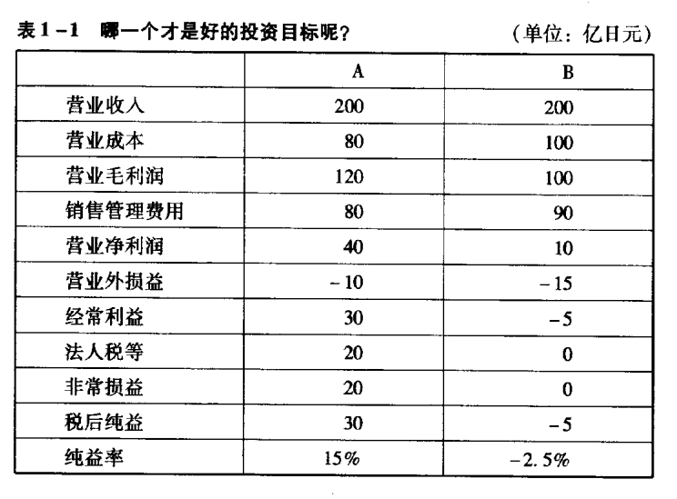

以上两张报表可能出自同一家公司，同一阶段，用不同的算法。

### （1）经营者走向“制造获利”的四个阶段

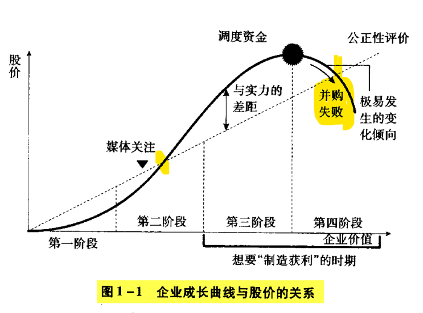

#### Step1.企业价值大于股票价值

**时间**：刚上市

**发展预测**：股价低于企业价值，只要企业发展不出现问题，市场股价会不断攀升。

#### Step2.企业价值与股票价值持恒

**时间**：成长期 

**发展预测**：股价说明企业实际价值得到市场认同。此时企业的主营业务仍然有发展空间，仍属于成长型企业。经营者被媒体宣传的频率开始增加。对于经营者而言，大半均为自家公司的股票，自家股票的上涨意味着身家的上涨。

#### Step3. 企业价值小于股票价值

**时间**：企业已经在市场中达到一定程度的占有率，仍有成长空间但无法持续高增长，意味着企业不久将会失去将自家股价维持在高位的能力。

**发展预测**：企业内部开始构思、策划新型事业企划案或大型并购案。而这一阶段的特色正是为**筹划上述方案筹谋运作资金**。

#### Step4. 为提高企业实际价值，着手并购或开发新型事业

**时间**：主营业务成长已经无路前行

**发展预测**：经营者开始利用手中的高额股票，全力筹集资金，推行大型并购案或者发展新型事业。

**特点**：投资银行与投资顾问开始对经营者围堵，为其提供各种投资信息；能够为经营者提供建设性建议的心腹在这段时期中会逐渐减少，负面新闻很难传达到经营者耳中。

----

企业在第4个阶段以后，应对策略主要是两种：

（1）借力发力（并购其他公司）

​		并购小公司与自身结合能够提升公司的整体价值

* 阿里巴巴的股价从去年年底一直跌，一家公司已经开始着手并购的时候可能就是他自身利润已经达到上限的时候

  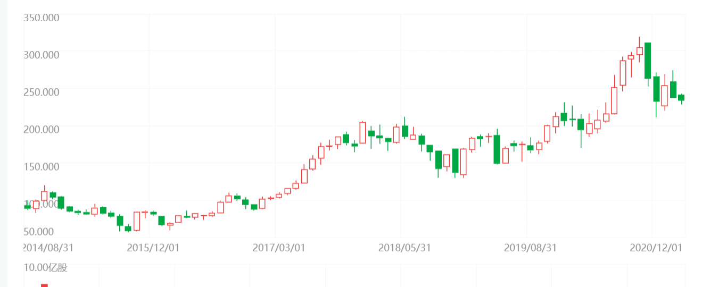

（2）自力更生（发展新型事业）

​		“国内市场已经饱和，开拓国外市场。”

### （2） 注册会计师与证券分析师的缺憾

* 注册会计师
  * 预算与期限的限制：必须在有限的日期内完成监督&签证工作
  * 所处单位事务所，与企业的产业形态完全不同，没有经商海磨砺，不懂生意经
  * 企业的签证会计师的签证酬劳由企业支付
* 证券分析师
  * 时间限制：财务审计报告第一时间提交
  * 报告提交后，数小时内读完简明财务报表和相关投资人资料，在决算结果发表日当晚整理出决算审核报告。
  * 他的资料信息均有委托分析的企业提供，如果就此提出此决算结果依据国语薄弱，则很可能因为无法提供客观有力的证据而的最该企业，使得自己很被动。

## 第二章 解读财务报表方式

虽然每股盈余（EPS)即获利指标与公司股价存在一定的联系，会对股价造成重大影响，但是这不能洞悉企业内部的真实情况。

* 读取财务报表的关键
  * 将损益表、资产负债表和现金流量表进行对照，详加解读，从整体出发，通过三份报表对企业财务状况、经营成果和现金流量信息加以分析，在一定程度上掌控企业现状，并且与其他企业情况相互比较。

### （1）资产负债表

#### I) 任何企业的基本运营模式循环

* 银行贷款与股东注资
* 用于设备或产品投资
* 为产品定价且高于进货价，以赊账方式卖出
* 产品成为销售成本
* 产品售出后产生利润
* 收回应收的账款（现金支付），获得现金
* 将现金用于还贷或者股东分红
* 在利用生于资金投资设备或产品……

资产负债表中的**“负债”**与**“股东权益”**所显示的是企业如何筹集资金，**资产栏**所显示的则是这些资金投资于何处。

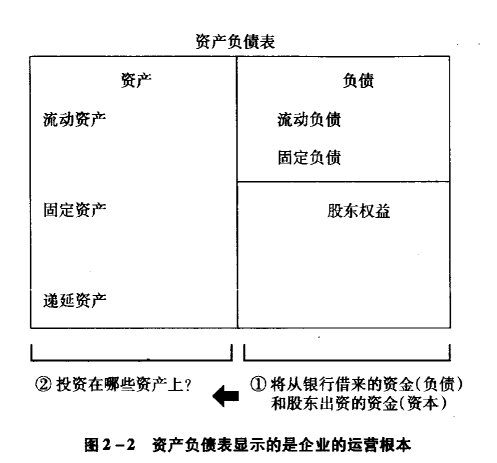

#### II) 注意资产栏

##### 有价证券

资产一栏除了注明企业拥有的现金和存款额度外，还列有属于**流动资产范畴**的**短期有价证券**等具有实时价值又能立即转换成现金的企业资产。这些资产有实际价值。

除了现金外，其他的资产项目：我把钱花在了这里

**举例说明**：企业投资股票，可以将支出额度以“有价证券”等名义列入资产表。在资产负债方面存在一项潜规则——将有价值的物品以购买时的价格列入资产兰（历史成本原则）。但是，有价证券这个可以跌也可以涨——投资的1亿美元可能会升值到3亿美元。但是资产负债表上向我们显示的只是“公司购买某资产时其时价是多少。

##### 有可能不能转换成现金的资产

应收账款、应收票据：客户公司是否已经倒闭，账款是否可以收回？

库存：虽然能够转换从现金，但是与资产负债表上显示的价值是否吻合？

##### 固定资产

危险性最大。

30万买的电脑-->会列入固定资产-->固定资产30万-->依据使用年限扣取这就费用，实用价值递减，最终价值为0.

#### III) 资产栏的资产分类

* 具有实际账面价值的资产
  * 现金
  * 存款
  * 有价证券等售出即可转化为账面金额的
* 账面价值不确定的资产
  * 应收账款
  * 应收票据
  * 库存
* 需要分期摊提的资产
  * 固定资产
    * 机械设备
    * 建筑物
    * 软件
  * 递延资产

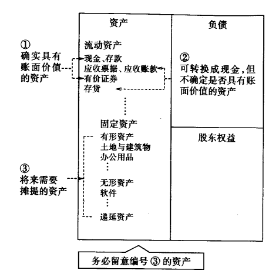

> 一定要记住：除了现金、存款、有价证券、应收票据、应收账款外，其他资产月多，也意味着将来需要支出的费用也越多。**固定资产价值越高的公司，更加需要引起我们的注意。**

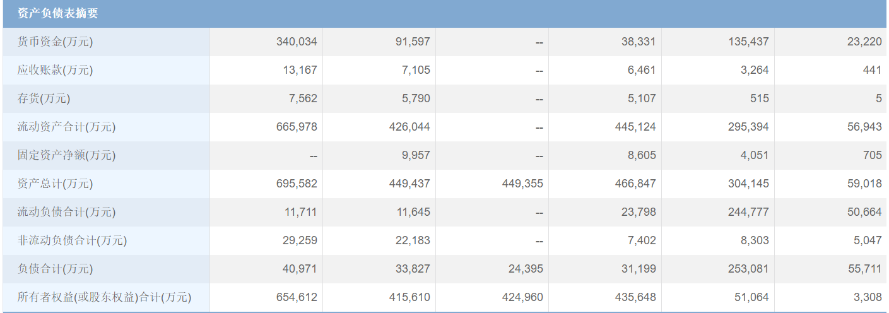

寒武纪资产表

#### IV）负债的分类

##### 应计负债与利润递延

负债的另一种类型：预备金和预收收益

与被金和预收收益并非“被认定会对企业运营造成不良影响”，而是“缺少它们会为企业运营带来一定负面后果“。

* 预备金
  * 为将来极有可能出现的损失所预留的应对资金。
  * 有应对风险（呆帐、退休准备、裁员准备）
* 预收收益
  * 已经收取了对方费用，但尚未为其提供相应服务
  * 预收资金时视为贷款，等实际提供相关服务时再转为收入项

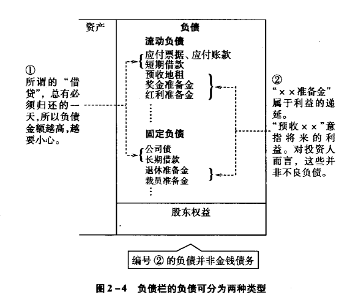

### (2) 损益表

从筹集资金开始，到将所筹资金投资于产品或设备，均记录在资产负债表里。

商品的进价与售出价、销售商品或提供服务时所需的人事成本、租房费用、宣传费用、利息、杂费、税金，将上述费用全部扣除，最终所剩金额即是企业收益（利润）

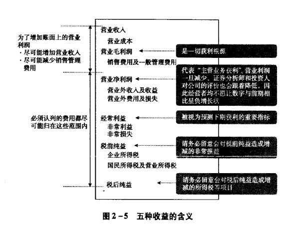

* 营业净利润——企业的获利
* 经常利益——预测下期业绩的重要标准
  * 与主营业务没有关联但是在运营中却时常出现的项目
  * 股票投资收入
  * 营业净利润-营业外损益=经常利益
* 非常损益（解读税前利益时要注意）
  * 制作本期财务报表期间突然产生的收益或损失
  * 售出具有账外利益性质的股票，因为获得收益
  * 因会计制度的変更暂时禅寺的较大损益等等
  * 税前利益=经常利益+非常利益
* 企业所得税
  * 并不是企业真正缴纳的全部税金，只是所有税金中属于本期的那一部分。

##### 如何拆穿损益表中的假象

如果希望账面获利高于实际获利，最便捷的方法就是改写损益表。只要企业预先计算未来获利，或延迟认列此刻费用，均可在一定程度上使损益表上的获利数字有所增加。

损益表中的获利究竟是“实际获利”还是“勉强制造出的获利”，我们只要仔细参照上面两份报表。

原则上，营业收入成长正常的企业应具备如下特征：

* 不仅账面获利有所增长，现金也会有所增长

* 资产运用更具有效率性

  第一个特征，我们需要以损益表和现金流量表作为参照对象。

  第二个特征，需要对照损益表和资产负债表

### (3) 现金流量表

真实证明现金流向，属于不容易操控的财务报表，受评估因素影响较小。

* 现金流量
  * 营业活动的现金流量
    * 体现企业从主营业务中赚取的现金数量
    * 从公司营业现金流量上完全可以看出其是否成长。
  * 投资活动的现金流
  * 投资现金流量
    * 体现公司为求发展，于何处投入多少现金
  * 融资现金流量
    * 体现借贷多少资金，又偿还多少资金
    * 企业进行投资后，若依然有剩余资金，可以用来偿还负债，属于融资现金流量

**投资现金流量控制在营业现金流量的收益范围内，企业运营状况最为理想。**

如果营业现金流无法满足投资现金流量，企业便只能向银行或投资人伸出手，从别处筹集资金。

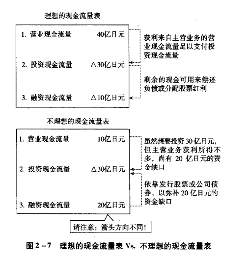

诸多在资产负债表和损益表中没有表明的事实，我们均可以从现金流量表中探知，特别是在我们洞悉获利本质以后。

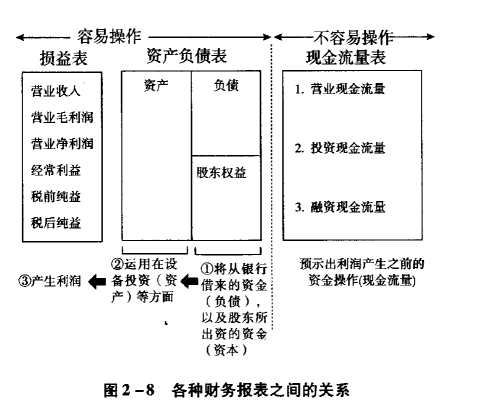

### (4) 三大基本财务报表之间的关联

>**要诀**：在查阅财务报表时，切忌机械地浏览报表上的数字，应该在阅览的同时，在头脑中刻画该公司的实际运营状况

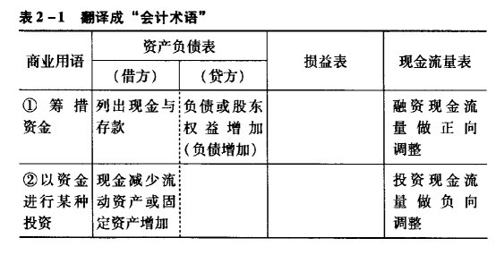

（4h看了52页，目前看到54/240)，参照读书速度，这本书需要24h看，还需要20h，每天2h+周末4h，下周末才可能看完。

##### 会计利益只是概略值

获利100万：该公司预计，可以获取100万日元的利润。

 因为对于一家公司，运营不是一年两年的时期，会持续数年甚至数十年。如果只注意现金指出，无法观察到企业的期末存活、设备以及建筑物的损益，那么，企业在进行大型投资时，较高的费用可能会给投资人造成顾虑。

#####  激进型获利调整

内容：想要利用权责发生基础制造获利，在会计准则允许的范畴内，最大限度提前计算收入，并且尽量延迟计算支付费用的时间。

##### 损益表VS现金流： 权责发生额

比较以权责发生制为原则的会计利益与以现金收付制为基础的现金利益，找出中间差额。

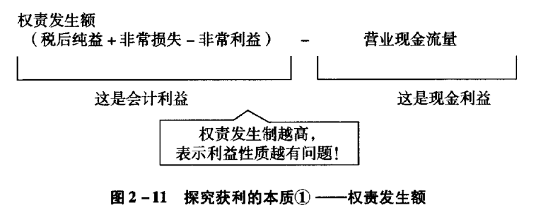

权责发生额较高，则意味着有问题，企业在账面上记入了过多尚未转化为现金的获利。

抛出股票获得非常利益，以赊账方式售出产品借以提升营业收入，增加库存成本压低本期销售成本，这些方式都会提升获利额度，但是会使得现金流量递减。

营业现金流的不足之处：加大应付账款与应付票据数额，延迟客户支付货款时间，现金流就会呈现增长趋势。

##### 损益表VS资产负债表

资产负债表中，有一部分项目终究会摊提费用，制药企业不断推迟费用的摊提时间，就会在无形之中提高资产额度。

###### 查验获利本质的第二个方法：资产收益率（ROA）

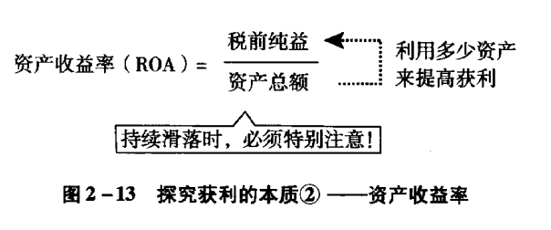

只要一直进行同一种交易，资产收益率基本上不会出现什么变化。营业收入上涨，表明该企业经济规模正在逐渐扩大，资产收益率随之增长自然是正常的时期。如果资产收益率一直呈现稳定状态，我们无需顾虑。但是如果资产收益率状态并不稳定，有走低趋势，我们就必须对这家公司的财务状况多加注意。

## 第三章 辨别虚增获利

提前获利

延迟认列指出费用

### （1）分析的重点放在比例上

分析的关键在于通过比例看数据。

##### 体制健全企业的完美比例

所谓体制健全，就是营业收入可以保持独立成长。

即使主营业务目前的发展一帆风顺，但是不代表它可以一直保持这个状态。哪怕时明星企业，也会随着环境的变化，转向成熟，然后逐渐走向衰败。

看到了116页